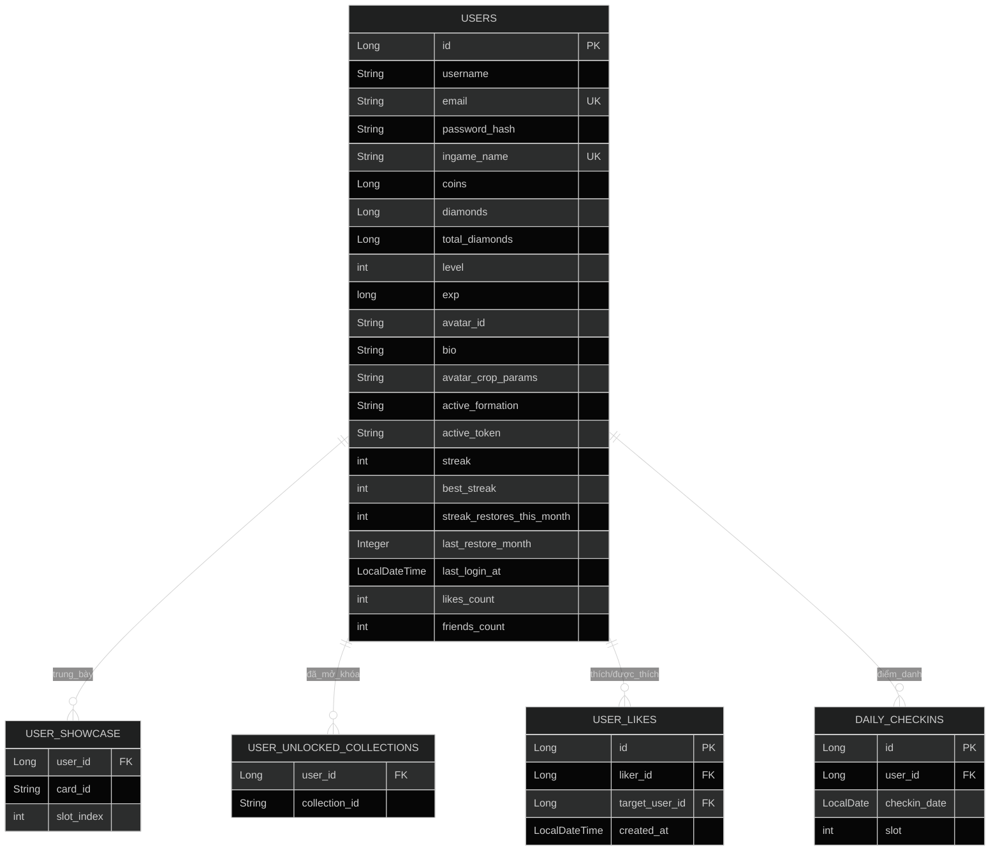
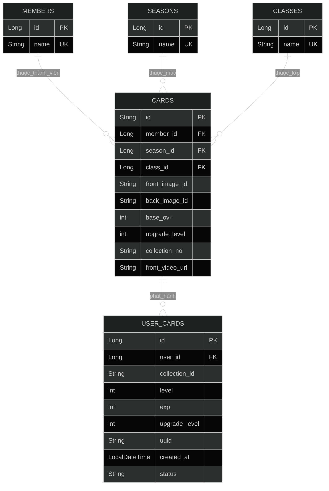
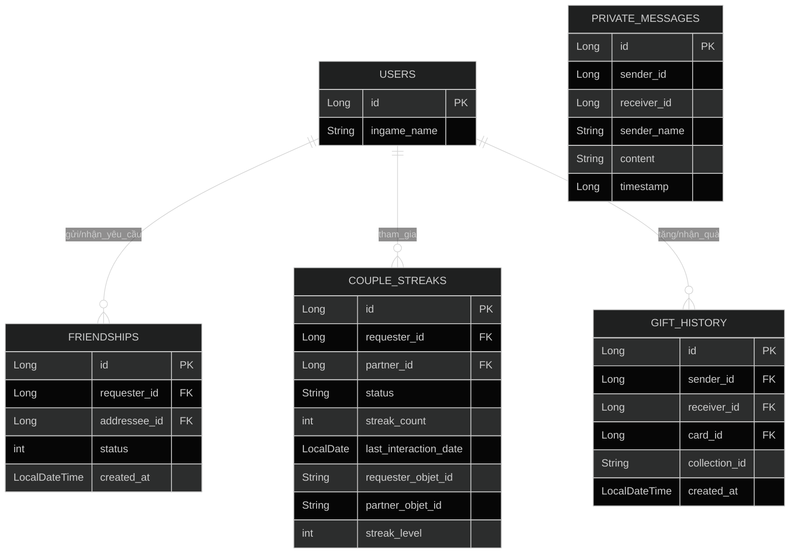
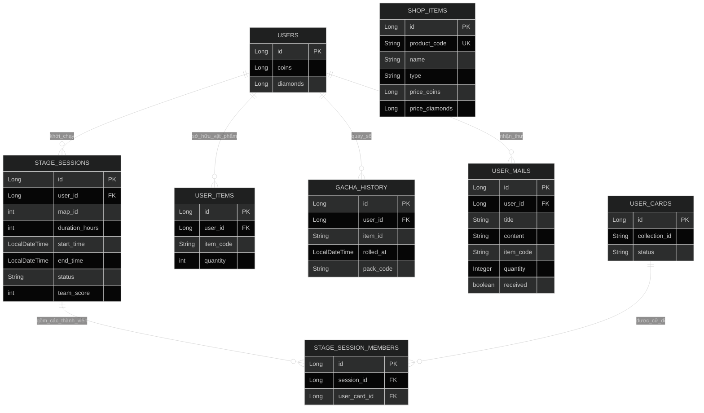
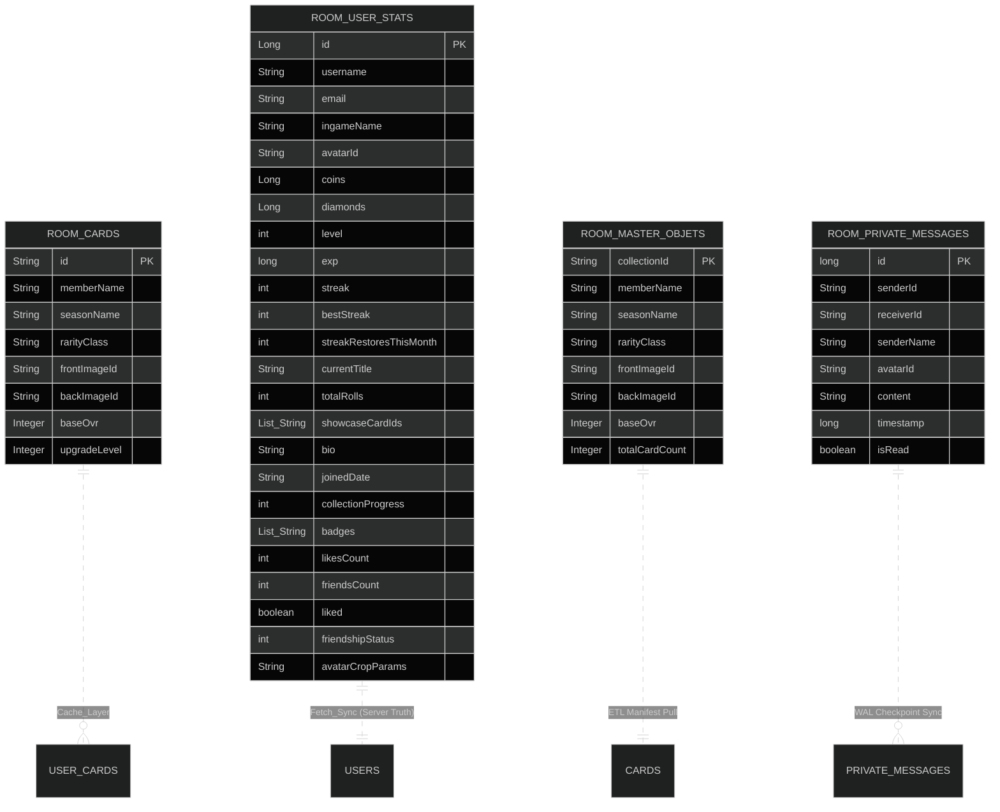

# PHASE 1: Khai phá Kiến trúc & Mô hình Dữ liệu (Hạ tầng Backend) - Dự án Mosco

Tài liệu này tổng hợp toàn bộ thông tin kiến trúc, mô hình dữ liệu thực tế trích xuất trực tiếp từ mã nguồn của dự án Mosco (Client Android & Backend Spring Boot).

---

## 1. Hệ Quản Trị CSDL & Cấu Trúc Chi Tiết Các Bảng (Database Schema)

Dự án Mosco áp dụng cơ chế lưu trữ phân tán nhằm hỗ trợ trải nghiệm **Local-First**:
*   **Hạ tầng Server (Backend):** Sử dụng hệ quản trị cơ sở dữ liệu quan hệ **MySQL 8.0** (Production) và hỗ trợ **H2 Database** (Dev/Test fallback).
*   **Hạ tầng Client (Android):** Sử dụng **SQLite** được bao bọc bởi thư viện **Room Database** (phiên bản `2.5.2`).

### A. Mô Hình Dữ Liệu Backend (MySQL Schema)

#### Sơ Đồ Quan Hệ Thực Thể (ERD - Entity Relationship Diagram)

Dưới đây là sơ đồ ERD chi tiết thể hiện toàn bộ các thực thể, thuộc tính và mối quan hệ quan trọng trong cơ sở dữ liệu MySQL của Mosco:

### Sơ Đồ Quan Hệ Thực Thể Server (MySQL Database ERD)
*Để hiển thị tối ưu trên khổ A4 dọc và dễ đọc đối với người cận thị, sơ đồ được chia thành 1 sơ đồ tổng quát rút gọn mức cao (High-Level) và 4 sơ đồ phân hệ thuộc tính chi tiết.*

#### 1. Sơ Đồ ERD Tổng Quát Mức Cao (High-Level Relationship ERD)
*Chỉ hiển thị các thực thể và mối quan hệ quan trọng giữa chúng mà không hiển thị chi tiết các trường để đảm bảo tính gọn nhẹ tối đa.*

```mermaid
%%{init: {'theme': 'dark', 'themeVariables': {'fontSize': '16px', 'fontFamily': 'Inter, Arial, sans-serif'}}}%%
graph TD
    %% Định nghĩa Style cho các nút %%
    classDef main fill:#7c3aed,stroke:#a78bfa,stroke-width:2px,color:#fff;
    classDef sub fill:#1e293b,stroke:#475569,stroke-width:1px,color:#cbd5e1;
    
    %% Thực thể trung tâm %%
    USERS[USERS (Bảng Người Dùng)]:::main

    %% Nhánh 1: Profile & Tương tác (Trải dọc) %%
    subgraph Profile_Subsystem ["1. Phân hệ Hồ sơ & Tương tác"]
        USER_SHOWCASE[USER_SHOWCASE]:::sub
        USER_UNLOCKED_COLLECTIONS[USER_UNLOCKED_COLLECTIONS]:::sub
        USER_LIKES[USER_LIKES]:::sub
        DAILY_CHECKINS[DAILY_CHECKINS]:::sub
    end

    %% Nhánh 2: Mạng xã hội & Chat (Trải dọc) %%
    subgraph Social_Subsystem ["2. Phân hệ Bạn bè & Giao tiếp"]
        FRIENDSHIPS[FRIENDSHIPS]:::sub
        COUPLE_STREAKS[COUPLE_STREAKS]:::sub
        GIFT_HISTORY[GIFT_HISTORY]:::sub
        PRIVATE_MESSAGES[PRIVATE_MESSAGES]:::sub
    end

    %% Nhánh 3: Kho đồ, Gacha & Đi cảnh (Trải dọc) %%
    subgraph Inventory_Subsystem ["3. Phân hệ Kho đồ & Vận hành"]
        USER_CARDS[USER_CARDS]:::sub
        USER_ITEMS[USER_ITEMS]:::sub
        GACHA_HISTORY[GACHA_HISTORY]:::sub
        USER_MAILS[USER_MAILS]:::sub
        STAGE_SESSIONS[STAGE_SESSIONS]:::sub
        STAGE_SESSION_MEMBERS[STAGE_SESSION_MEMBERS]:::sub
    end

    %% Nhánh 4: Từ điển Metadata Thẻ bài %%
    subgraph Metadata_Subsystem ["4. Từ điển Thẻ bài (Metadata)"]
        CARDS[CARDS]:::sub
        MEMBERS[MEMBERS]:::sub
        SEASONS[SEASONS]:::sub
        CLASSES[CLASSES]:::sub
    end

    %% Liên kết luồng dữ liệu hướng dọc (Top-Down) %%
    USERS --> Profile_Subsystem
    USERS --> Social_Subsystem
    USERS --> Inventory_Subsystem

    %% Mối quan hệ giữa kho đồ và danh mục thẻ %%
    MEMBERS & SEASONS & CLASSES --> CARDS
    CARDS --> USER_CARDS
    
    %% Mối quan hệ phái cử đi cảnh %%
    STAGE_SESSIONS --> STAGE_SESSION_MEMBERS
    USER_CARDS --> STAGE_SESSION_MEMBERS
```

#### 2. Sơ Đồ ERD Các Phân Hệ Chi Tiết (Subsystem ERD with Attributes)

##### Phân Hệ A: Người Dùng & Tương Tác Hồ Sơ (User Profile & Interaction Subsystem)
*Bao gồm các thông tin cá nhân của người chơi, trạng thái điểm danh, thả tim hồ sơ và tuỳ biến trưng bày.*



##### Phân Hệ B: Thẻ Bài & Kho Đồ Thẻ (Card Metadata & Inventory Subsystem)
*Quản lý danh mục từ điển thẻ bài gốc (Seasons, Members, Classes) và thực tế sở hữu thẻ bài của người chơi.*



##### Phân Hệ C: Mạng Xã Hội, Bạn Bè & Trò Chuyện (Social, Friends & Chat Subsystem)
*Mô tả mối quan hệ bạn bè, chuỗi streak kết đôi couple, lịch sử tặng quà và lịch sử tin nhắn riêng tư.*



##### Phân Hệ D: Gacha, Cửa Hàng, Hòm Thư & Đi Cảnh AFK (Gacha, Shop, Mail & AFK Expedition Subsystem)
*Quản lý giao dịch mua sắm, lịch sử quay gói gacha, hệ thống thư hệ thống và hệ thống phái cử thẻ bài đi thám hiểm.*



### Sơ Đồ Lưu Trữ Room SQLite & Ranh Giới Đồng Bộ Client (Local-First Sync ERD)
*Sơ đồ này biểu diễn cấu trúc Room SQLite cục bộ trên thiết bị và cơ chế ánh xạ dữ liệu trực tiếp với Server.*



#### Chi Tiết Cấu Trúc Các Bảng

Dưới đây là chi tiết các bảng được định nghĩa thông qua các JPA Entity trong gói `com.vn.jet.mosco.spinserver.model`:

#### 1. Bảng `users` (Entity: [User.java](file:///d:/MEox/UITer/DOAN/Mosco_Megre/Mosco/server/src/main/java/com/vn/jet/mosco/spinserver/model/User.java))
Lưu trữ thông tin chi tiết của người chơi và các chỉ số tích lũy.
*   `id` (Kiểu: `Long` | PK | IDENTITY)
*   `username` (Kiểu: `String` | Nullable)
*   `email` (Kiểu: `String` | Unique | Non-null)
*   `password_hash` (Kiểu: `String` | Non-null | Bị ẩn trong JSON bằng `@JsonIgnore` / Mapping Java: `passwordHash`)
*   `ingame_name` (Kiểu: `String` | Unique | Nullable / Mapping Java: `ingameName`)
*   `coins` (Kiểu: `Long` | Default: `0L`)
*   `diamonds` (Kiểu: `Long` | Default: `0L`)
*   `total_diamonds` (Kiểu: `Long` | Default: `0L` | Tích lũy để xếp hạng Wealth / Mapping Java: `totalDiamonds`)
*   `level` (Kiểu: `int` | Default: `1` | Tính động qua công thức `(exp / 1000) + 1`)
*   `exp` (Kiểu: `long` | Default: `0L`)
*   `avatar_id` (Kiểu: `String` | Default: `"1"` / Mapping Java: `avatarId`)
*   `bio` (Kiểu: `String` | Độ dài: `255`)
*   `avatar_crop_params` (Kiểu: `String` | Độ dài: `255` | Metadata để tái thiết lập việc cắt avatar / Mapping Java: `avatarCropParams`)
*   `active_formation` (Kiểu: `String` | Độ dài: `255` | Default: `"null,null,null,null,null,null"` / Mapping Java: `activeFormation`)
*   `active_token` (Kiểu: `String` | Độ dài: `800` / Mapping Java: `activeToken`)
*   `streak` (Kiểu: `int` | Default: `0`)
*   `best_streak` (Kiểu: `int` | Default: `0` / Mapping Java: `bestStreak`)
*   `streak_restores_this_month` (Kiểu: `int` | Default: `0` / Mapping Java: `streakRestoresThisMonth`)
*   `last_restore_month` (Kiểu: `Integer` | Default: `0` / Mapping Java: `lastRestoreMonth`)
*   `last_login_at` (Kiểu: `LocalDateTime` / Mapping Java: `lastLoginAt`)
*   `likes_count` (Kiểu: `int` | Default: `0` / Mapping Java: `likesCount`)
*   `friends_count` (Kiểu: `int` | Default: `0` / Mapping Java: `friendsCount`)

#### 2. Bảng `user_showcase` (Bảng phụ liên kết ElementCollection)
Trưng bày thẻ trên hồ sơ người dùng.
*   `user_id` (FK references `users(id)`)
*   `card_id` (Kiểu: `String`)
*   `slot_index` (Kiểu: `int` | OrderColumn)

#### 3. Bảng `user_unlocked_collections` (Bảng phụ liên kết ElementCollection)
Bộ sưu tập card đã được người chơi mở khóa.
*   `user_id` (FK references `users(id)`)
*   `collection_id` (Kiểu: `String`)
*   *Chỉ mục tối ưu:* Index `idx_unlocked_coll_user` (trên cột `user_id`)

#### 4. Bảng `members` (Entity: [Member.java](file:///d:/MEox/UITer/DOAN/Mosco_Megre/Mosco/server/src/main/java/com/vn/jet/mosco/spinserver/model/Member.java))
Từ điển danh sách các thành viên nhóm nhạc (phục vụ chuẩn hóa 3NF).
*   `id` (Kiểu: `Long` | PK | IDENTITY)
*   `name` (Kiểu: `String` | Unique | Non-null)

#### 5. Bảng `seasons` (Entity: [Season.java](file:///d:/MEox/UITer/DOAN/Mosco_Megre/Mosco/server/src/main/java/com/vn/jet/mosco/spinserver/model/Season.java))
Từ điển các mùa phát hành thẻ bài (VD: Atom01, Binary01...).
*   `id` (Kiểu: `Long` | PK | IDENTITY)
*   `name` (Kiểu: `String` | Unique | Non-null)

#### 6. Bảng `classes` (Entity: [CardClass.java](file:///d:/MEox/UITer/DOAN/Mosco_Megre/Mosco/server/src/main/java/com/vn/jet/mosco/spinserver/model/CardClass.java))
Từ điển phân lớp hiếm của thẻ bài (VD: First, Double, Motion...).
*   `id` (Kiểu: `Long` | PK | IDENTITY)
*   `name` (Kiểu: `String` | Unique | Non-null)

#### 7. Bảng `cards` (Entity: [Card.java](file:///d:/MEox/UITer/DOAN/Mosco_Megre/Mosco/server/src/main/java/com/vn/jet/mosco/spinserver/model/Card.java))
Chứa thông tin thẻ bài gốc được đồng bộ từ file JSON (Galactic Master Data).
*   `id` (Kiểu: `String` | PK | Độ dài `36` | UUID sinh từ file JSON)
*   `member_id` (FK references `members(id)` | EAGER)
*   `season_id` (FK references `seasons(id)` | EAGER)
*   `class_id` (FK references `classes(id)` | EAGER)
*   `front_image_id` (Kiểu: `String` | Non-null | Chứa mã băm của ảnh mặt trước / Mapping Java: `frontImageId`)
*   `back_image_id` (Kiểu: `String` | Non-null | Chứa mã băm của ảnh mặt sau / Mapping Java: `backImageId`)
*   `base_ovr` (Kiểu: `int` | Default: `70` / Mapping Java: `baseOvr`)
*   `upgrade_level` (Kiểu: `int` | Default: `1` / Mapping Java: `upgradeLevel`)
*   `collection_no` (Kiểu: `String` / Mapping Java: `collectionNo`)
*   `front_video_url` (Kiểu: `String` | Dành cho thẻ Motion / Mapping Java: `frontVideoUrl`)
*   `updated_at` (Kiểu: `LocalDateTime` | Tự động cập nhật thời gian qua `@UpdateTimestamp` / Mapping Java: `updatedAt`)

#### 8. Bảng `user_cards` (Entity: [UserCard.java](file:///d:/MEox/UITer/DOAN/Mosco_Megre/Mosco/server/src/main/java/com/vn/jet/mosco/spinserver/model/UserCard.java))
Các thẻ bài cụ thể thuộc sở hữu của từng người chơi.
*   `id` (Kiểu: `Long` | PK | IDENTITY)
*   `user_id` (FK references `users(id)` | LAZY / Mapping Java: `user`)
*   `collection_id` (Kiểu: `String` | Non-null | Ánh xạ tới ID trong bảng `cards` / Mapping Java: `collectionId`)
*   `level` (Kiểu: `int` | Default: `1`)
*   `exp` (Kiểu: `int` | Default: `0`)
*   `upgrade_level` (Kiểu: `int` | Default: `1` | Mức cộng đập thẻ FO4 / Mapping Java: `upgradeLevel`)
*   `uuid` (Kiểu: `String` | Nullable)
*   `created_at` (Kiểu: `LocalDateTime` | Tự động điền qua `@CreationTimestamp` / Mapping Java: `createdAt`)
*   `status` (Kiểu: `String` | Default: `"AVAILABLE"`)

#### 9. Bảng `friendships` (Entity: [Friendship.java](file:///d:/MEox/UITer/DOAN/Mosco_Megre/Mosco/server/src/main/java/com/vn/jet/mosco/spinserver/model/Friendship.java))
Mối quan hệ kết bạn giữa hai người chơi.
*   `id` (Kiểu: `Long` | PK | IDENTITY)
*   `requester_id` (Kiểu: `Long` | Non-null | Tham chiếu tới `users(id)` / Mapping Java: `requesterId`)
*   `addressee_id` (Kiểu: `Long` | Non-null | Tham chiếu tới `users(id)` / Mapping Java: `addresseeId`)
*   `status` (Kiểu: `int` | Default: `0` | `0` = PENDING, `1` = ACCEPTED)
*   `created_at` (Kiểu: `LocalDateTime` / Mapping Java: `createdAt`)
*   *Lưu ý:* Các trường `requester_id` và `addressee_id` là **Khóa ngoại Logic** (Logical FK). Trong mã nguồn Java, chúng chỉ được định nghĩa là trường `Long` đơn thuần chứ không sử dụng liên kết JPA thực thể `@ManyToOne`, giúp tránh các truy vấn đệ quy và khóa bảng ngầm không cần thiết nhằm tối ưu hiệu năng.
*   *Ràng buộc đặc biệt:* UniqueConstraint trên bộ đôi `(requester_id, addressee_id)` để tránh spam gửi trùng lời mời.
    > [!WARNING]
    > **Lỗi cấu hình JPA trong code:** Annotation `@UniqueConstraint(columnNames = {"requesterId", "addresseeId"})` trong `Friendship.java` hiện đang dùng tên biến Java thay vì tên cột MySQL vật lý (`requester_id`, `addressee_id`), có thể làm mất hiệu lực ràng buộc hoặc gây lỗi khởi động.

#### 10. Bảng `gacha_history` (Entity: [GachaHistory.java](file:///d:/MEox/UITer/DOAN/Mosco_Megre/Mosco/server/src/main/java/com/vn/jet/mosco/spinserver/model/GachaHistory.java))
Lịch sử lượt quay gacha thưởng.
*   `id` (Kiểu: `Long` | PK | IDENTITY)
*   `user_id` (FK references `users(id)` | LAZY / Mapping Java: `user`)
*   `item_id` (Kiểu: `String` | Non-null / Mapping Java: `itemId`)
*   `rarity` (Kiểu: `String` | Độ dài: `50` | Non-null)
*   `quantity` (Kiểu: `int` | Default: `1`)
*   `rolled_at` (Kiểu: `LocalDateTime` / Mapping Java: `rolledAt`)
*   `pack_code` (Kiểu: `String` | Độ dài: `100` / Mapping Java: `packCode`)
*   `source` (Kiểu: `String` | Độ dài: `50` | Default: `"GACHA_ROLL"`)
*   *Chỉ mục tối ưu:* Index `idx_gacha_history_user` (trên cột `user_id`) và `idx_gacha_history_rolled` (trên cột `rolled_at`).
    > [!WARNING]
    > **Lỗi cấu hình JPA trong code:** Định nghĩa Index `idx_gacha_history_rolled` trong `GachaHistory.java` sử dụng `columnList = "rolledAt"` (tên biến Java) thay vì tên cột vật lý `rolled_at`.

#### 11. Bảng `shop_items` (Entity: [ShopItem.java](file:///d:/MEox/UITer/DOAN/Mosco_Megre/Mosco/server/src/main/java/com/vn/jet/mosco/spinserver/model/ShopItem.java))
Vật phẩm có sẵn trên Shop bán hàng.
*   `id` (Kiểu: `Long` | PK | IDENTITY)
*   `product_code` (Kiểu: `String` | Unique | Non-null / Mapping Java: `productCode`)
*   `name` (Kiểu: `String` | Non-null)
*   `description` (Kiểu: `String`)
*   `type` (Kiểu: `String` | Non-null | VD: `PACK`, `BUFF`, `CARD`)
*   `price_coins` (Kiểu: `Long` | Default: `0L` / Mapping Java: `priceCoins`)
*   `price_diamonds` (Kiểu: `Long` | Default: `0L` / Mapping Java: `priceDiamonds`)
*   `image_uri` (Kiểu: `String` / Mapping Java: `imageUri`)
*   `end_time` (Kiểu: `Long` | Default: `-1L` | `-1` tức là bán vĩnh viễn / Mapping Java: `endTime`)
*   `metadata` (Kiểu: `String` | Text | Lưu cấu hình JSON cho gói/buff)

#### 12. Bảng `user_items` (Entity: [UserItem.java](file:///d:/MEox/UITer/DOAN/Mosco_Megre/Mosco/server/src/main/java/com/vn/jet/mosco/spinserver/model/UserItem.java))
Vật phẩm sở hữu của người dùng (như vé quay, gói phôi).
*   `id` (Kiểu: `Long` | PK | IDENTITY)
*   `user_id` (FK references `users(id)` | LAZY / Mapping Java: `user`)
*   `item_code` (Kiểu: `String` | Non-null / Mapping Java: `itemCode`)
*   `quantity` (Kiểu: `int` | Default: `0`)

#### 13. Bảng `user_likes` (Entity: [UserLike.java](file:///d:/MEox/UITer/DOAN/Mosco_Megre/Mosco/server/src/main/java/com/vn/jet/mosco/spinserver/model/UserLike.java))
Hành động thích hồ sơ giữa các người dùng.
*   `id` (Kiểu: `Long` | PK | IDENTITY)
*   `liker_id` (Kiểu: `Long` | Non-null | Tham chiếu tới `users(id)` / Mapping Java: `likerId`)
*   `target_user_id` (Kiểu: `Long` | Non-null | Tham chiếu tới `users(id)` / Mapping Java: `targetUserId`)
*   `created_at` (Kiểu: `LocalDateTime` / Mapping Java: `createdAt`)
*   *Lưu ý:* `liker_id` và `target_user_id` là **Khóa ngoại Logic** để tối ưu hóa hiệu năng truy vấn.
*   *Ràng buộc đặc biệt:* UniqueConstraint trên bộ `(liker_id, target_user_id)` chống spam click thích.
    > [!WARNING]
    > **Lỗi cấu hình JPA trong code:** Annotation `@UniqueConstraint(columnNames = {"likerId", "targetUserId"})` trong `UserLike.java` sử dụng tên biến Java thay vì tên cột MySQL vật lý (`liker_id`, `target_user_id`).

#### 14. Bảng `user_mails` (Entity: [UserMail.java](file:///d:/MEox/UITer/DOAN/Mosco_Megre/Mosco/server/src/main/java/com/vn/jet/mosco/spinserver/model/UserMail.java))
Thư điện tử đính kèm quà của người dùng.
*   `id` (Kiểu: `Long` | PK | IDENTITY)
*   `user_id` (FK references `users(id)` | LAZY / Mapping Java: `user`)
*   `title` (Kiểu: `String` | Non-null)
*   `content` (Kiểu: `String` | Non-null)
*   `item_code` (Kiểu: `String` | Nullable | Quà đính kèm / Mapping Java: `itemCode`)
*   `quantity` (Kiểu: `Integer` | Nullable)
*   `received` (Kiểu: `boolean` | Default: `false` | Đã nhận quà đính kèm hay chưa)
*   `created_at` (Kiểu: `LocalDateTime` | Default: Hiện tại / Mapping Java: `createdAt`)

#### 15. Bảng `couple_streaks` (Entity: [CoupleStreak.java](file:///d:/MEox/UITer/DOAN/Mosco_Megre/Mosco/server/src/main/java/com/vn/jet/mosco/spinserver/model/CoupleStreak.java))
Thông tin đồng hành và duy trì streak giữa các cặp đôi.
*   `id` (Kiểu: `Long` | PK | IDENTITY)
*   `requester_id` (FK references `users(id)` | LAZY / Mapping Java: `requester`)
*   `partner_id` (FK references `users(id)` | LAZY / Mapping Java: `partner`)
*   `status` (Kiểu: `String` | Non-null | `PENDING`, `ACTIVE`, `DECLINED`)
*   `streak_count` (Kiểu: `int` / Mapping Java: `streakCount`)
*   `last_interaction_date` (Kiểu: `LocalDate` / Mapping Java: `lastInteractionDate`)
*   `request_date` (Kiểu: `LocalDate` / Mapping Java: `requestDate`)
*   `requester_interaction_date` (Kiểu: `LocalDate` / Mapping Java: `requesterInteractionDate`)
*   `partner_interaction_date` (Kiểu: `LocalDate` / Mapping Java: `partnerInteractionDate`)
*   `requester_objet_id` (Kiểu: `String` / Mapping Java: `requesterObjetId`)
*   `partner_objet_id` (Kiểu: `String` / Mapping Java: `partnerObjetId`)
*   `objet_changes_this_week` (Kiểu: `int` | Default: `0` / Mapping Java: `objetChangesThisWeek`)
*   `last_objet_change_date` (Kiểu: `LocalDate` / Mapping Java: `lastObjetChangeDate`)
*   `streak_level` (Kiểu: `int` | Default: `1` / Mapping Java: `streakLevel`)
*   `requester_grade` (Kiểu: `int` | Default: `1` / Mapping Java: `requesterGrade`)
*   `partner_grade` (Kiểu: `int` | Default: `1` / Mapping Java: `partnerGrade`)
*   `created_at` (Kiểu: `LocalDateTime` / Mapping Java: `createdAt`)
*   `updated_at` (Kiểu: `LocalDateTime` / Mapping Java: `updatedAt`)

#### 16. Bảng `daily_checkins` (Entity: [DailyCheckin.java](file:///d:/MEox/UITer/DOAN/Mosco_Megre/Mosco/server/src/main/java/com/vn/jet/mosco/spinserver/model/DailyCheckin.java))
Lịch sử điểm danh theo slot của người chơi.
*   `id` (Kiểu: `Long` | PK | IDENTITY)
*   `user_id` (Kiểu: `Long` | Non-null | Tham chiếu tới `users(id)` / Mapping Java: `userId`)
*   `checkin_date` (Kiểu: `LocalDate` | Non-null / Mapping Java: `checkinDate`)
*   `slot` (Kiểu: `int` | Non-null | `0` = Sáng, `1` = Trưa, `2` = Tối)
*   *Lưu ý:* `user_id` là **Khóa ngoại Logic** để tối ưu hóa việc query.
*   *Ràng buộc đặc biệt:* UniqueConstraint trên bộ `(user_id, checkin_date, slot)`.
    > [!WARNING]
    > **Lỗi cấu hình JPA trong code:** Annotation `@UniqueConstraint(columnNames = {"userId", "checkinDate", "slot"})` trong `DailyCheckin.java` sử dụng tên biến Java thay vì các tên cột MySQL vật lý (`user_id`, `checkin_date`, `slot`).

#### 17. Bảng `private_messages` (Entity: [PrivateMessage.java](file:///d:/MEox/UITer/DOAN/Mosco_Megre/Mosco/server/src/main/java/com/vn/jet/mosco/spinserver/model/PrivateMessage.java))
Tin nhắn trò chuyện riêng tư của người chơi (Server-side logs).
*   `id` (Kiểu: `Long` | PK | IDENTITY)
*   `sender_id` (Kiểu: `Long` | Non-null / Mapping Java: `senderId`)
*   `receiver_id` (Kiểu: `Long` | Non-null / Mapping Java: `receiverId`)
*   `sender_name` (Kiểu: `String` / Mapping Java: `senderName`)
*   `avatar_id` (Kiểu: `String` / Mapping Java: `avatarId`)
*   `content` (Kiểu: `String` | Text | Non-null)
*   `timestamp` (Kiểu: `Long` | Non-null)

#### 18. Bảng `gift_history` (Entity: [GiftHistory.java](file:///d:/MEox/UITer/DOAN/Mosco_Megre/Mosco/server/src/main/java/com/vn/jet/mosco/spinserver/model/GiftHistory.java))
Lịch sử gửi tặng card giữa người chơi.
*   `id` (Kiểu: `Long` | PK | IDENTITY)
*   `sender_id` (Kiểu: `Long` | Non-null / Mapping Java: `senderId`)
*   `receiver_id` (Kiểu: `Long` | Non-null / Mapping Java: `receiverId`)
*   `card_id` (Kiểu: `Long` | Non-null | Tham chiếu tới `user_cards(id)` / Mapping Java: `cardId`)
*   `collection_id` (Kiểu: `String` | Non-null / Mapping Java: `collectionId`)
*   `receiver_read` (Kiểu: `boolean` | Default: `false` | UI hiển thị badge "mới" cho người nhận / Mapping Java: `receiverRead`)
*   `created_at` (Kiểu: `LocalDateTime` / Mapping Java: `createdAt`)
*   *Lưu ý:* `sender_id`, `receiver_id` và `card_id` là **Khóa ngoại Logic** không có ràng buộc vật lý, được xử lý kiểm tra nghiệp vụ trên code.

#### 19. Bảng `stage_sessions` (Entity: [StageSession.java](file:///d:/MEox/UITer/DOAN/Mosco_Megre/Mosco/server/src/main/java/com/vn/jet/mosco/spinserver/model/StageSession.java))
Hành trình đi cảnh/thám hiểm.
*   `id` (Kiểu: `Long` | PK | IDENTITY)
*   `user_id` (FK references `users(id)` | LAZY / Mapping Java: `user`)
*   `map_id` (Kiểu: `int` | Non-null / Mapping Java: `mapId`)
*   `duration_hours` (Kiểu: `int` | Non-null / Mapping Java: `durationHours`)
*   `start_time` (Kiểu: `LocalDateTime` | Non-null / Mapping Java: `startTime`)
*   `end_time` (Kiểu: `LocalDateTime` | Non-null / Mapping Java: `endTime`)
*   `status` (Kiểu: `String` | Default: `"RUNNING"` | `RUNNING`, `COMPLETED`, `CANCELED`)
*   `team_score` (Kiểu: `int` | Non-null / Mapping Java: `teamScore`)
*   `member_ids` (Kiểu: `String` | Non-null | Danh sách ID thành viên tham gia / Mapping Java: `memberIds`)

#### 20. Bảng `stage_session_members` (Entity: [StageSessionMember.java](file:///d:/MEox/UITer/DOAN/Mosco_Megre/Mosco/server/src/main/java/com/vn/jet/mosco/spinserver/model/StageSessionMember.java))
Liên kết các thẻ bài người dùng sử dụng tham gia phiên thám hiểm.
*   `id` (Kiểu: `Long` | PK | IDENTITY)
*   `session_id` (FK references `stage_sessions(id)` | LAZY / Mapping Java: `stageSession`)
*   `user_card_id` (FK references `user_cards(id)` | LAZY / Mapping Java: `userCard`)

---

### B. Mô Hình Dữ Liệu Client (Room SQLite Schema)

Các bảng được lưu trữ cục bộ trên SQLite của thiết bị Android nhằm duy trì trạng thái **Local-First** và phục vụ chế độ offline:

#### 1. Bảng `cards` (Entity: [CardEntity.java](file:///d:/MEox/UITer/DOAN/Mosco_Megre/Mosco/client/app/src/main/java/com/vn/jet/mosco/model/CardEntity.java))
Bảng lưu trữ thông tin thẻ bài người dùng sở hữu (đã được khử chuẩn - **Denormalization** để hiển thị danh sách siêu tốc).
*   `id` (Kiểu: `String` | PK | NonNull)
*   `memberName` (Kiểu: `String` | Khử chuẩn trực tiếp từ Dict)
*   `seasonName` (Kiểu: `String` | Khử chuẩn trực tiếp từ Dict)
*   `rarityClass` (Kiểu: `String`)
*   `frontImageId` (Kiểu: `String` | Cloudflare Image ID)
*   `backImageId` (Kiểu: `String` | Cloudflare Image ID)
*   `baseOvr` (Kiểu: `Integer`)
*   `upgradeLevel` (Kiểu: `Integer`)
*   *Chỉ mục tối ưu (Indices):* `idx_season` (trên cột `seasonName`) và `idx_member` (trên cột `memberName`).

#### 2. Bảng `user_stats` (Entity: [UserStats.java](file:///d:/MEox/UITer/DOAN/Mosco_Megre/Mosco/client/app/src/main/java/com/vn/jet/mosco/model/UserStats.java))
Lưu trạng thái chỉ số của người chơi hiện tại nhằm render nhanh Header và Profile.
*   `id` (Kiểu: `Long` | PK)
*   `username` (Kiểu: `String`)
*   `email` (Kiểu: `String`)
*   `ingameName` (Kiểu: `String`)
*   `avatarId` (Kiểu: `String`)
*   `coins` (Kiểu: `Long`)
*   `diamonds` (Kiểu: `Long`)
*   `level` (Kiểu: `int`)
*   `exp` (Kiểu: `long`)
*   `streak` (Kiểu: `int`)
*   `bestStreak` (Kiểu: `int`)
*   `streakRestoresThisMonth` (Kiểu: `int`)
*   `currentTitle` (Kiểu: `String` | Default: `""`)
*   `totalRolls` (Kiểu: `int` | Default: `0`)
*   `showcaseCardIds` (Kiểu: `TEXT` | Lưu chuỗi JSON Text mảng ID thẻ bài / Mapping Java: `List<String>` được chuyển đổi tự động qua `ShowcaseConverter`)
*   `bio` (Kiểu: `String` | Default: `""`)
*   `joinedDate` (Kiểu: `String` | Default: `""`)
*   `collectionProgress` (Kiểu: `int` | Default: `0`)
*   `badges` (Kiểu: `TEXT` | Lưu chuỗi JSON Text danh sách các danh hiệu / Mapping Java: `List<String>` được Room tự động hóa chuyển đổi qua Gson)
*   `likesCount` (Kiểu: `int` | Default: `0`)
*   `friendsCount` (Kiểu: `int` | Default: `0`)
*   `liked` (Kiểu: `boolean` | Default: `false`)
*   `friendshipStatus` (Kiểu: `int` | Default: `0`)
*   `avatarCropParams` (Kiểu: `String` | Default: `""`)

#### 3. Bảng `master_objets` (Entity: [MasterObjetEntity.java](file:///d:/MEox/UITer/DOAN/Mosco_Megre/Mosco/client/app/src/main/java/com/vn/jet/mosco/model/MasterObjetEntity.java))
Bộ dữ liệu gốc khổng lồ chứa metadata của toàn bộ ~20,000+ thẻ bài trong toàn vũ trụ game, đồng bộ trực tiếp từ server để tra cứu offline (Galactic Master Data), loại bỏ OOM do parse JSON khổng lồ mỗi lần vào ứng dụng.
*   `collectionId` (Kiểu: `String` | PK | NonNull)
*   `memberName` (Kiểu: `String`)
*   `seasonName` (Kiểu: `String`)
*   `rarityClass` (Kiểu: `String`)
*   `frontImageId` (Kiểu: `String`)
*   `backImageId` (Kiểu: `String`)
*   `baseOvr` (Kiểu: `Integer`)
*   `totalCardCount` (Kiểu: `Integer`)

#### 4. Bảng `private_messages` (Entity: [PrivateChatMessage.java](file:///d:/MEox/UITer/DOAN/Mosco_Megre/Mosco/client/app/src/main/java/com/vn/jet/mosco/model/PrivateChatMessage.java))
Tin nhắn trò chuyện riêng tư của người chơi (lưu cục bộ để chat offline và render nhanh).
*   `id` (Kiểu: `long` | PK | AutoGenerate)
*   `senderId` (Kiểu: `String`)
*   `receiverId` (Kiểu: `String`)
*   `senderName` (Kiểu: `String`)
*   `avatarId` (Kiểu: `String`)
*   `content` (Kiểu: `String`)
*   `timestamp` (Kiểu: `long`)
*   `isRead` (Kiểu: `boolean` | Default: `false`)

---

## 2. Mô Hình Kiến Trúc Phần Mềm Đang Áp Dụng

Dự án áp dụng mô hình kiến trúc phân lớp chuẩn hóa ở cả Backend và Client:

### A. Server-Side: Kiến Trúc Phân Lớp Spring Web MVC
Toàn bộ logic nghiệp vụ tuân thủ luồng đi một chiều:
```
Client Request ──> Controller ──> Service (Nghiệp vụ) ──> Repository ──> Database (MySQL)
```
*   **Controller Layer:** Tiếp nhận yêu cầu HTTP REST/WebSocket, điều hướng dữ liệu thông qua DTO. Ví dụ: [UpgradeController.java](file:///d:/MEox/UITer/DOAN/Mosco_Megre/Mosco/server/src/main/java/com/vn/jet/mosco/spinserver/controller/UpgradeController.java).
*   **Service Layer:** Chứa logic nghiệp vụ cốt lõi, áp dụng transaction nghiệp vụ và quản trị concurrency. Ví dụ: [UpgradeService.java](file:///d:/MEox/UITer/DOAN/Mosco_Megre/Mosco/server/src/main/java/com/vn/jet/mosco/spinserver/service/UpgradeService.java).
*   **Repository Layer:** Spring Data JPA interface kế thừa `JpaRepository` để giao tiếp trực tiếp với DB. Ví dụ: [UserCardRepository.java](file:///d:/MEox/UITer/DOAN/Mosco_Megre/Mosco/server/src/main/java/com/vn/jet/mosco/spinserver/repository/UserCardRepository.java).

### B. Client-Side: Android MVVM + Repository Pattern + Local-First
Dự án được viết hoàn toàn bằng **100% Java** và tuân thủ mô hình khuyến nghị của Google:
```
View (Activity/Fragment) <──> ViewModel (LiveData) <──> Repository <──┬──> Room DB (Offline)
                                                                      └──> Retrofit API (Online)
```
*   **View Layer:** Lắng nghe và vẽ UI dựa trên trạng thái (UI State) nhận về từ ViewModel. Ví dụ: `FriendListFragment` quan sát LiveData để hiển thị danh sách.
*   **ViewModel Layer:** Đóng vai trò giữ trạng thái UI và truyền phát hành động của người dùng tới Repository. Sống độc lập với vòng đời của Activity/Fragment. Ví dụ: `ProfileViewModel.java`.
*   **Repository Layer:** Trọng tâm của kiến trúc Local-First. Router dữ liệu: Ưu tiên trả về kết quả lập tức từ Room DB cục bộ để render UI, song song đó gọi API REST (Retrofit) hoặc WebSocket để sync dữ liệu mới nhất từ Server, sau đó cập nhật đè lại Room DB. Ví dụ: `AuthRepository.java`, `GachaRepository.java`.

---

## 3. Các Giải Pháp Kỹ Thuật Cốt Lõi Đã Cài Đặt Trong Code

Dưới đây là các giải pháp tối ưu hóa hiệu năng và bảo mật đã được thực thi chi tiết trong mã nguồn:

### A. Tối Ưu Băng Thông & Ảnh Thẻ Bài (Cloudflare WebP Interceptor)
*   **Vấn đề:** Tránh tải 3GB dữ liệu ảnh gốc làm tràn bộ nhớ (OOM) và chậm mạng của thiết bị (đặc biệt là Android 9 Emulator).
*   **Giải pháp:** Sử dụng OkHttp Interceptor tại [ApiClient.java](file:///d:/MEox/UITer/DOAN/Mosco_Megre/Mosco/client/app/src/main/java/com/vn/jet/mosco/network/ApiClient.java) ép sử dụng định dạng nén tối ưu WebP cho toàn bộ các request hướng tới Cloudflare CDN:
    ```java
    if (request.url().host().contains("imagedelivery.net")) {
        request = request.newBuilder()
                .header("Accept", "image/webp")
                .build();
    }
    ```
*   **Thư viện áp dụng:** `Glide:4.15.1` (Android) đảm nhận cache ảnh cục bộ.

### B. Đập Thẻ An Toàn (Pessimistic Locking & Transaction)
*   **Vấn đề:** Phòng chống tuyệt đối lỗi Race Condition (nhận nhiều request đập thẻ cùng lúc gây mất mát tài nguyên hoặc nhân bản thẻ bài trái phép).
*   **Giải pháp:** 
    1.  Tại [UserCardRepository.java](file:///d:/MEox/UITer/DOAN/Mosco_Megre/Mosco/server/src/main/java/com/vn/jet/mosco/spinserver/repository/UserCardRepository.java), định nghĩa cơ chế khóa bi quan ghi trực tiếp vào DB:
        ```java
        @Lock(LockModeType.PESSIMISTIC_WRITE)
        @Query("SELECT c FROM UserCard c WHERE c.id = :id")
        Optional<UserCard> findWithLockById(@Param("id") Long id);
        ```
    2.  Tại [UpgradeService.java](file:///d:/MEox/UITer/DOAN/Mosco_Megre/Mosco/server/src/main/java/com/vn/jet/mosco/spinserver/service/UpgradeService.java), luồng nâng cấp thẻ được bao bọc trong `@Transactional`. Khi tiến trình bắt đầu, cả thẻ chính và danh sách thẻ nguyên liệu đều được khóa lại bằng `PESSIMISTIC_WRITE`. Mọi luồng khác cố truy cập sẽ phải đợi cho đến khi Transaction commit hoặc rollback hoàn tất.

### C. Cơ Chế Auto-Backup SQLite Chạy Ngầm (WorkManager & WAL Checkpoint)
*   **Vấn đề:** Đảm bảo sao lưu dữ liệu Room DB lên Cloud định kỳ và không làm hỏng dữ liệu khi copy file database SQLite đang mở (lỗi dính các file log WAL/SHM chưa kịp cam kết).
*   **Giải pháp:**
    1.  Tác vụ chạy ngầm được quản lý bởi Android `WorkManager` thông qua [BackupWorker.java](file:///d:/MEox/UITer/DOAN/Mosco_Megre/Mosco/client/app/src/main/java/com/vn/jet/mosco/worker/BackupWorker.java).
    2.  Tại [BackupManager.java](file:///d:/MEox/UITer/DOAN/Mosco_Megre/Mosco/client/app/src/main/java/com/vn/jet/mosco/utils/BackupManager.java), trước khi thực hiện copy file, ép SQLite cam kết toàn bộ log từ file ghi trước WAL (`-wal`) và shared memory (`-shm`) vào file DB chính:
        ```java
        Cursor c = db.query("PRAGMA wal_checkpoint(TRUNCATE)", null);
        ```
    3.  Sau đó copy an toàn file `mosco_db` chính, nén cục bộ (chỉ giữ lại 2 bản backup gần nhất nhờ chính sách Retention Policy) và đồng bộ qua API Multipart lên cloud.

### D. Hệ Thống Realtime Chat (STOMP WebSockets)
*   **Vấn đề:** Duy trì kênh chat thế giới và chat riêng tư thời gian thực hiệu năng cao.
*   **Giải pháp:** Sử dụng giao thức STOMP trên nền tảng WebSocket. Client sử dụng [WebSocketManager.java](file:///d:/MEox/UITer/DOAN/Mosco_Megre/Mosco/client/app/src/main/java/com/vn/jet/mosco/network/WebSocketManager.java) kết nối tới Server, lắng nghe các topic `/topic/world`, `/topic/private.{userId}` và `/topic/streak.{userId}` bằng RxJava.
*   **Thư viện áp dụng:** `StompProtocolAndroid:1.6.6` kết hợp `RxJava` để xử lý bất đồng bộ luồng message.

### E. AI Auto-Crop Avatar (Survive Reinstall)
*   **Vấn đề:** Tự động phát hiện khuôn mặt của người chơi để crop làm avatar và giữ nguyên được tỷ lệ crop chuẩn xác khi người chơi gỡ cài đặt và cài lại app.
*   **Giải pháp:**
    1.  Sử dụng Google ML Kit `face-detection` để nhận diện tọa độ khuôn mặt trên ảnh gốc, kết hợp thư viện `ucrop` để tự động crop khung ảnh tập trung vào khuôn mặt.
    2.  Lưu thông số crop (`avatarCropParams`) dạng chuỗi metadata trên Server. Khi cài lại ứng dụng, Client kéo metadata này từ Server về để tái hiện chính xác hình ảnh đã crop mà không cần lưu trữ bức ảnh gốc kích thước lớn.

### F. ETL Pipeline Đồng Bộ Định Kỳ & Caching Cục Bộ
*   **Vấn đề:** Nạp dữ liệu danh mục thẻ bài mới nhất từ JSON vào MySQL Server một cách hiệu quả, tránh tắc nghẽn mạng và N+1 query trên các bảng từ điển lớn.
*   **Giải pháp:**
    *   Tác vụ chạy ngầm định kỳ bằng `@Scheduled(fixedDelay = 86400000)` tại [EtlService.java](file:///d:/MEox/UITer/DOAN/Mosco_Megre/Mosco/server/src/main/java/com/vn/jet/mosco/spinserver/service/EtlService.java).
    *   Sử dụng Caching cục bộ (`HashMap`) cho các thực thể từ điển (`Member`, `Season`, `CardClass`) để tái sử dụng ngay trong phiên làm việc của job, tránh truy vấn cơ sở dữ liệu liên tục.
    *   Bóc tách Image ID bằng Regular Expression từ URL gốc để lưu trữ gọn nhẹ và thực hiện UPSERT theo lô (`batch save` với batch size `200` qua `saveAllAndFlush`).

### G. Cơ Chế Sinh Số Ngẫu Nhiên Khí Quyển (Atmospheric Noise Chaos Seed)
*   **Vấn đề:** Đảm bảo độ ngẫu nhiên thực sự tối đa của hệ thống RNG (Quay Gacha, đập thẻ, tỷ lệ biến động chỉ số) nhưng không làm tăng độ trễ (latency) của API chính (tránh nghẽn mạng do gọi API bên ngoài đồng bộ trên main thread).
*   **Giải pháp:**
    *   Được định nghĩa tại [ChaosTheoryHelper.java](file:///d:/MEox/UITer/DOAN/Mosco_Megre/Mosco/server/src/main/java/com/vn/jet/mosco/spinserver/utils/ChaosTheoryHelper.java). Sử dụng một đối tượng `SecureRandom` duy nhất, an toàn đa luồng và có entropy cao.
    *   **Cơ chế lấy hạt giống (Re-seed) ngầm:** Một `ScheduledExecutorService` đơn luồng chạy nền tự động gọi tới API của **random.org** (`https://www.random.org/integers/?num=1&min=1&max=1000000000&col=1&base=10&format=plain&rnd=new`) định kỳ mỗi **10 phút** để kéo số True Random (Atmospheric Noise - Nhiễu khí quyển).
    *   **Trộn entropy tối đa:** Số True Random kéo về được đem XOR bit với thời gian hệ thống chính xác cao `System.nanoTime()` trước khi truyền vào làm seed: `random.setSeed(seed ^ System.nanoTime())`.
    *   **Bất đồng bộ hoàn toàn:** Cuộc gọi API random.org được nạp ngầm hoàn toàn, các request game chính (như `SpinSystem`, `UpgradeSystem`) chỉ đọc số từ `SecureRandom` nội địa qua các hàm `nextDouble()`, `nextInt()` mà không bao giờ bị block bởi API random.org.
    *   **Fallback an toàn:** Nếu random.org lỗi kết nối hoặc API quá tải, hệ thống tự động fallback dùng hạt giống nội bộ `System.nanoTime() ^ System.currentTimeMillis()`.

### H. Cơ Chế Sao Lưu & Khôi Phục Lịch Sử Chat (Zalo-style Chat Backup & Cloud Sync)
*   **Vấn đề:** Lịch sử tin nhắn chat riêng tư giữa các người chơi (`PrivateChatMessage`) chỉ được lưu trữ cục bộ trong Room Database (`private_messages` table) để tăng tốc tải và hỗ trợ chat offline. Làm thế nào để đảm bảo người chơi có thể khôi phục lại toàn bộ lịch sử chat này khi thay đổi thiết bị hoặc cài lại ứng dụng (tương tự cơ chế của Zalo)?
*   **Giải pháp:**
    *   **Tích hợp SQLite Backup toàn vẹn:** Cơ chế sao lưu dữ liệu SQLite chính của thiết bị (`mosco_db`) trong `BackupManager` bao quát luôn cả bảng `private_messages` chứa lịch sử chat cục bộ.
    *   **Quy trình Sao lưu cục bộ:** Trước khi copy file database chính, hệ thống ép SQLite hoàn tất việc cam kết (checkpoint) ghi toàn bộ log WAL và dữ liệu shared memory vào file chính qua lệnh: `PRAGMA wal_checkpoint(TRUNCATE)` tại [BackupManager.java](file:///d:/MEox/UITer/DOAN/Mosco_Megre/Mosco/client/app/src/main/java/com/vn/jet/mosco/utils/BackupManager.java). Tiếp đó nén và lưu trữ cục bộ trong `/files/backups/`.
    *   **Đồng bộ lên Máy chủ Đám mây (Cloud Sync):** Gửi file bản sao lưu `.db` lên server Spring Boot thông qua API Multipart `/api/backup/upload` xử lý bởi [BackupController.java](file:///d:/MEox/UITer/DOAN/Mosco_Megre/Mosco/server/src/main/java/com/vn/jet/mosco/spinserver/controller/BackupController.java). Dữ liệu này được lưu trữ trong thư mục `storage/backups` của server Spring Boot gắn với mã User ID. Đồng thời, Server áp dụng chính sách Retention Policy (chỉ giữ lại tối đa 5 bản sao lưu mới nhất của người dùng này và tự động dọn dẹp các bản cũ hơn để tiết kiệm dung lượng lưu trữ).
    *   **Quy trình Khôi phục (Restore):** Khi kích hoạt khôi phục, Client tải file `.db` từ server về, đóng kết nối Room DB hiện tại, xóa toàn bộ file log WAL/SHM cũ trên đĩa và ghi đè trực tiếp file `.db` mới tải về để khôi phục toàn bộ lịch sử chat, card và stats.
    *   **Auto Cloud Backup (Tự động sao lưu định kỳ):** Sử dụng Android `WorkManager` thông qua `BackupWorker` tự động trigger tiến trình sao lưu và đẩy lên cloud khi các điều kiện phần cứng an toàn (đang sạc/pin an toàn) với tần suất được cấu hình linh động từ 6 giờ đến 30 ngày trong giao diện cài đặt profile (`ProfileMenuFragment` $\rightarrow$ `WorkScheduler.scheduleAutoBackup()`).
    *   **Cơ chế chống gian lận dữ liệu (Anti-Rollback Cheat / Server Truth):** 
        *   *Kịch bản:* Người dùng có 5 objet $\rightarrow$ thực hiện Backup. Sau đó, người dùng mua thêm 5 objet (tổng 10 objet) và đập xịt thẻ từ +8 rớt xuống +5 $\rightarrow$ sau đó thực hiện Restore lại bản backup cũ.
        *   *Kết quả:* Hệ thống **KHÔNG** cho phép quay về 5 objet và thẻ +8. Dữ liệu trên client sẽ tự động đồng bộ và hiển thị chính xác là **10 objet và thẻ +5**.
        *   *Nguyên lý thực tế:* Mọi giao dịch nhạy cảm (mua thẻ, gacha, đập thẻ nâng cấp) bắt buộc phải qua REST API và lưu trữ trực tiếp trên MySQL Server (Server Truth). Khi client thực hiện Restore bản backup cũ (chỉ có 5 objet, thẻ +8), ngay khi ứng dụng kết nối mạng và mở kho đồ, client sẽ tự động gọi API `getUserCards` (tại [DatabaseLoader.java](file:///d:/MEox/UITer/DOAN/Mosco_Megre/Mosco/client/app/src/main/java/com/vn/jet/mosco/utils/DatabaseLoader.java#L529)) để kéo danh sách thẻ từ server về và ghi đè (overwrite) cache cục bộ. Do đó, server đóng vai trò là "Nguồn chân lý" duy nhất, ngăn chặn triệt để hành vi Save/Load state để gian lận đập thẻ hoặc nhân bản vật phẩm.

### I. Cơ Chế Quét & Đồng Bộ Metadata Theo Lịch Trình (Scheduled Metadata Scraping & ETL Sync)
*   **Vấn đề:** Đảm bảo hệ cơ sở dữ liệu gốc (MySQL) trên Server luôn cập nhật đầy đủ các thẻ bài nghệ sĩ mới nhất được phát hành từ nguồn bên ngoài (objekt.top) một cách tự động, an toàn và sắp xếp thứ tự chuẩn xác.
*   **Giải pháp:**
    *   Được cài đặt tại [AssetManagementService.java](file:///d:/MEox/UITer/DOAN/Mosco_Megre/Mosco/server/src/main/java/com/vn/jet/mosco/spinserver/service/AssetManagementService.java).
    *   **Kích hoạt khi Startup:** Sử dụng `@EventListener(ApplicationReadyEvent.class)` tự động khởi chạy chu kỳ đồng bộ lần đầu ngay khi Spring Boot Server khởi động thành công để đảm bảo dữ liệu đĩa và bộ nhớ đồng nhất tức thời.
    *   **Quét định kỳ hàng giờ:** Sử dụng bộ lên lịch Spring `@Scheduled(cron = "0 0 * * * *")` kích hoạt tiến trình cào dữ liệu hàng giờ để cập nhật liên tục các thẻ bài mới ra mắt.
    *   **Tiến trình cào (Scraping):** OkHttpClient gửi request GET có kèm tiêu đề User-Agent giả lập trình duyệt tới API `https://objekt.top/api/collection?artist=tripleS&limit=20000` thông qua OkHttpClient.
    *   **Phân tích & Sắp xếp (Parse & Sort):** Parse dữ liệu cào được thành danh sách JsonObject, sau đó sắp xếp theo thời gian tạo (`createdAt` giảm dần - mới nhất xếp đầu). 
    *   **Cập nhật Manifest & Kích hoạt ETL:** Lưu dữ liệu đã sắp xếp vào file `database.json`. Nếu kích thước tệp tin thay đổi so với bản cũ, cập nhật lại file `manifest.json` với nhãn thời gian `lastSync` mới nhất. Tiếp theo, gọi ngầm tiến trình `EtlService.runEtlJob()` để thực hiện phân tích cú pháp file JSON mới và đồng bộ UPSERT dữ liệu thô vào các bảng MySQL (`members`, `seasons`, `classes`, `cards`). Cuối cùng làm mới bộ nhớ đệm `CardDataService` của backend.

---

## 4. Các điểm bất cập, không đồng bộ & Lỗi cấu hình JPA (Known Limitations & Architectural Smells)

Trong quá trình đối chiếu tài liệu kiến trúc này với mã nguồn thực tế của dự án Mosco, chúng tôi đã phát hiện một số điểm bất cập nghiêm trọng trong thiết kế cũng như các lỗi cấu hình trong mã nguồn. Dưới đây là tình trạng thực tế và các phương án xử lý trên nhánh `refactor-all`:

### A. Lỗi cấu hình JPA Unique Constraints & Indexes (Server-side) - [ĐÃ KHẮC PHỤC TRÊN NHÁNH refactor-all]
*   **Trạng thái:** Đã sửa lỗi và commit thành công trên nhánh `refactor-all`.
*   **Vấn đề trước đó:** Các thực thể `Friendship.java`, `UserLike.java`, và `DailyCheckin.java` định nghĩa các ràng buộc duy nhất (`uniqueConstraints`) bằng cách sử dụng tên trường trong lớp Java (camelCase) thay vì tên cột vật lý trong cơ sở dữ liệu (snake_case). Cụ thể:
    *   `Friendship.java` dùng `{"requesterId", "addresseeId"}` thay vì `{"requester_id", "addressee_id"}`.
    *   `UserLike.java` dùng `{"likerId", "targetUserId"}` thay vì `{"liker_id", "target_user_id"}`.
    *   `DailyCheckin.java` dùng `{"userId", "checkinDate", "slot"}` thay vì `{"user_id", "checkin_date", "slot"}`.
    *   Tương tự, `GachaHistory.java` định nghĩa Index `idx_gacha_history_rolled` sử dụng `columnList = "rolledAt"` thay vì `rolled_at`.
*   **Ảnh hưởng:** Hibernate khi tự động sinh và cập nhật Schema cơ sở dữ liệu (`spring.jpa.hibernate.ddl-auto=update`) sẽ bỏ qua hoặc sinh lỗi tạo chỉ mục/ràng buộc, dẫn tới việc cơ sở dữ liệu MySQL không có các khoá duy nhất này, tăng nguy cơ trùng lặp dữ liệu do race condition.
*   **Giải pháp đã thực hiện:** Sửa đổi các tham số `columnNames` và `columnList` trong annotations của toàn bộ 4 file Entity trên về đúng tên cột vật lý tương ứng của MySQL.

### B. Nguy cơ không đồng nhất trạng thái Cấp độ người dùng (Level Column Stale State) - [ĐÃ KHẮC PHỤC TRÊN NHÁNH refactor-all]
*   **Trạng thái:** Đã sửa lỗi và commit thành công trên nhánh `refactor-all`.
*   **Vấn đề trước đó:** Trong `User.java`, thuộc tính `level` được lưu trữ trực tiếp dưới dạng một cột vật lý trong database (`@Column(nullable = false) private int level = 1;`). Tuy nhiên, phương thức getter `getLevel()` lại tính toán động dựa trên kinh nghiệm: `return (int) (this.exp / 1000) + 1;`. Do JPA sử dụng cơ chế truy cập trực tiếp vào trường dữ liệu (Field-based Access), Hibernate khi thực hiện ghi xuống database sẽ ghi trực tiếp giá trị của trường `level`. Nếu chỉ thay đổi `exp` (qua `setExp()`) mà không cập nhật trường `level` (qua `setLevel()`), cột `level` trong database sẽ bị cũ (stale), làm sai lệch các truy vấn xếp hạng người dùng theo cấp độ trực tiếp bằng SQL.
*   **Giải pháp đã thực hiện:** Bổ sung logic tự động cập nhật trường `level` đồng bộ bên trong phương thức `setExp(long exp)` của lớp `User.java`: `this.level = (int) (this.exp / 1000) + 1;`, đảm bảo trường `level` luôn khớp với `exp` trước khi Hibernate lưu thực thể vào database.

### C. Không đồng nhất kiểu dữ liệu của ID Tin nhắn (Chat ID Type Mismatch) - [CÒN TỒN TẠI / ĐANG PHÁT TRIỂN]
*   **Vấn đề:** SQLite cục bộ của Client lưu trữ `senderId` và `receiverId` trong bảng `private_messages` dưới dạng `String` (TEXT) thông qua `PrivateChatMessage.java`. Ngược lại, Server MySQL lưu trữ hai khoá ngoại logic này dưới dạng `Long` (BIGINT) thông qua `PrivateMessage.java`.
*   **Ảnh hưởng:** Mặc dù Jackson có thể tự động chuyển đổi chuỗi số thành `Long` ở phía Server, sự không đồng nhất này khiến Client phải thực hiện các chuyển đổi kiểu dữ liệu rườm rà (ví dụ: `String.valueOf(partnerId)`) và làm giảm hiệu năng truy vấn của Room DB trên điện thoại do so sánh chuỗi chậm hơn so với số nguyên.
*   **Giải pháp đề xuất:** Đồng bộ kiểu dữ liệu của `senderId` và `receiverId` về kiểu `long` ở cả phía Client SQLite và Server MySQL trong đợt refactor toàn diện tiếp theo của Client App.

### D. Tính năng Avatar Auto-Crop (Survive Reinstall) chưa hoàn thiện trên Client - [CÒN TỒN TẠI / ĐANG PHÁT TRIỂN]
*   **Vấn đề:** Tài liệu mô tả cơ chế sao lưu toạ độ cắt ảnh (`avatarCropParams`) dạng `"xPercent,yPercent,sizePercent"` lên máy chủ để tái hiện ảnh đại diện chính xác khi cài lại ứng dụng. Tuy nhiên, mã nguồn Java của Client (`ProfileFragment.java`) chỉ sử dụng thư viện `uCrop` để cắt ảnh cục bộ và lưu đè file cache chứ **chưa triển khai việc tính toán tỉ lệ toạ độ** hoặc gửi thông số này lên Server trong request `updateProfile`.
*   **Ảnh hưởng:** Tham số `avatarCropParams` lưu trên máy chủ luôn là `null` hoặc chuỗi rác cũ. Khi người dùng cài lại ứng dụng, toạ độ crop thủ công sẽ bị mất hoàn toàn và client buộc phải dùng thuật toán ML Kit nhận diện khuôn mặt tự động (`SmartFaceCropTransformation`), làm mất đi trải nghiệm crop thủ công mong muốn của người dùng.
*   **Giải pháp đề xuất:** Bổ sung logic tính toán toạ độ tỉ lệ cắt trong callback của `uCrop` trên Client, cập nhật vào `SessionManager` và đồng bộ qua API `updateProfile` lên máy chủ.
