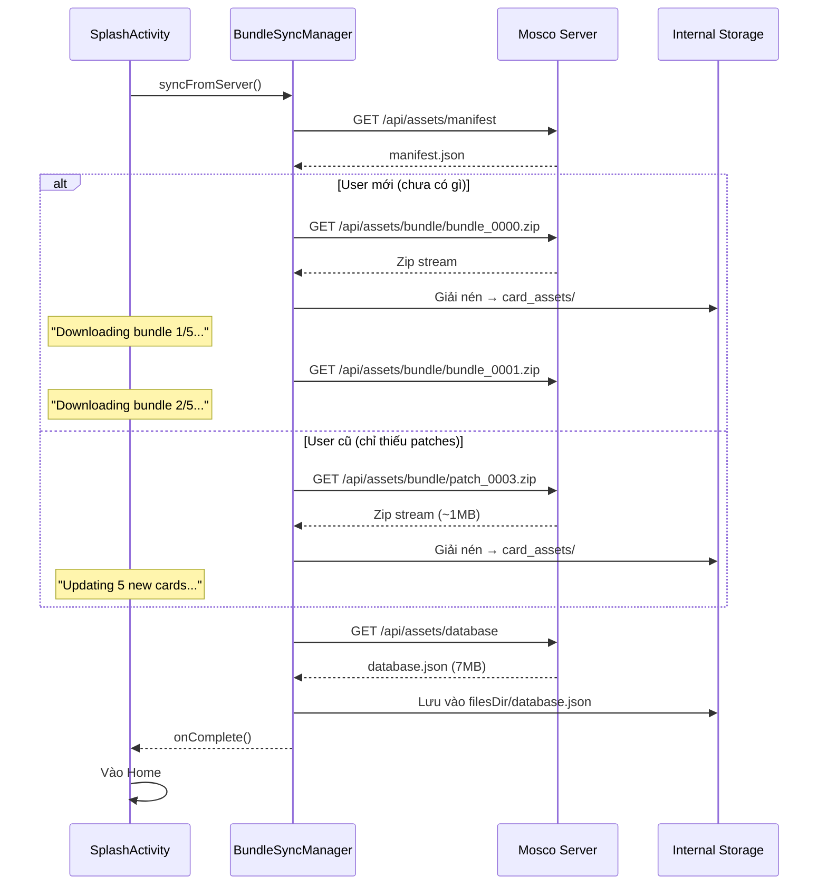

# Phase 2: Android Client — Smart Sync Engine

## Bối cảnh

Server đã hoàn thành Chunking Engine (Phase 1):
- **5 Sealed Bundles** (`bundle_0000.zip` → `bundle_0004.zip`), mỗi gói ~2GB (2.000 Objet)
- **Patch system** (`patch_NNNN.zip`) cho ảnh mới mỗi đợt cập nhật
- **Manifest API** tại `GET /api/assets/manifest` liệt kê tất cả gói
- **Download API** tại `GET /api/assets/bundle/{filename}` tải từng gói

### Hiện trạng Client

| Thành phần | Chức năng hiện tại |
|---|---|
| [AppConfig.java](file:///d:/MEox/UITer/DOAN/Mosco_Megre/Mosco/client/app/src/main/java/com/vn/jet/mosco/utils/AppConfig.java) | `BASE_URL = "http://192.168.1.86:8080/"` — URL Server duy nhất |
| [DatabaseLoader.java](file:///d:/MEox/UITer/DOAN/Mosco_Megre/Mosco/client/app/src/main/java/com/vn/jet/mosco/utils/DatabaseLoader.java) | Đọc `database.json` từ **APK assets/** (tĩnh, compile-time) |
| [CardAssetManager.java](file:///d:/MEox/UITer/DOAN/Mosco_Megre/Mosco/client/app/src/main/java/com/vn/jet/mosco/utils/CardAssetManager.java) | Tải lẻ từng ảnh 2x từ **Cloudflare** → lưu `card_assets/` (Internal Storage) |
| [SplashActivity.java](file:///d:/MEox/UITer/DOAN/Mosco_Megre/Mosco/client/app/src/main/java/com/vn/jet/mosco/SplashActivity.java) | Check assets → thiếu thì gọi `downloadAllAssets()` → hiển thị progress bar |

---

## Kiến trúc mục tiêu



---

## Proposed Changes

---

### 1. Constants & Config

#### [MODIFY] [AppConfig.java](file:///d:/MEox/UITer/DOAN/Mosco_Megre/Mosco/client/app/src/main/java/com/vn/jet/mosco/utils/AppConfig.java)

Thêm các endpoint tài nguyên:

```java
// Asset Sync Endpoints (tương đối, ghép với BASE_URL)
public static final String ASSET_MANIFEST_URL = BASE_URL + "api/assets/manifest";
public static final String ASSET_DATABASE_URL = BASE_URL + "api/assets/database";
public static final String ASSET_BUNDLE_URL = BASE_URL + "api/assets/bundle/"; // + filename
```

---

### 2. Core — Thành phần mới

#### [NEW] [BundleSyncManager.java](file:///d:/MEox/UITer/DOAN/Mosco_Megre/Mosco/client/app/src/main/java/com/vn/jet/mosco/utils/BundleSyncManager.java)

**Thành phần trung tâm** — quản lý toàn bộ quá trình tải Zip từ Server:

```
BundleSyncManager
├── syncFromServer(Context, SyncProgressListener)   ← Entry point
│   ├── fetchManifest()                              ← GET manifest.json
│   ├── determineBundlesToDownload()                 ← So sánh local vs server
│   ├── downloadAndExtractBundle(filename)           ← GET + ZipInputStream
│   ├── downloadLatestDatabase()                     ← GET database.json
│   └── updateLocalSyncState()                       ← SharedPreferences
├── extractZipStream(InputStream, File outputDir)    ← Giải nén vào disk
└── SyncProgressListener (interface)
    ├── onBundleStart(name, index, total)
    ├── onBundleProgress(bytesDownloaded, totalBytes)
    ├── onBundleComplete(name)
    ├── onSyncComplete(totalNewImages)
    └── onSyncError(errorMessage)
```

**Chi tiết logic `syncFromServer()`:**

1. **Bước 1 — Fetch Manifest:**
   - `GET AppConfig.ASSET_MANIFEST_URL`
   - Parse JSON → lấy `sealedBundles[]` và `patches[]`

2. **Bước 2 — Xác định gói cần tải:**
   - Đọc `SharedPreferences` key `sync_downloaded_bundles` (Set\<String\> tên các file đã tải)
   - So sánh với danh sách trong manifest
   - **User mới**: Set rỗng → cần tải tất cả bundles + patches
   - **User cũ**: Đã có bundle_0000→0004 → chỉ cần tải patches mới

3. **Bước 3 — Tải và giải nén từng gói:**
   - Dùng OkHttp `GET AppConfig.ASSET_BUNDLE_URL + filename`
   - **KHÔNG lưu file Zip vào disk** → stream trực tiếp vào `ZipInputStream`
   - Giải nén mỗi `ZipEntry` → ghi file vào `card_assets/`
   - Sau mỗi gói xong → thêm tên file vào `sync_downloaded_bundles`

4. **Bước 4 — Cập nhật database.json:**
   - `GET AppConfig.ASSET_DATABASE_URL`
   - Lưu vào `context.getFilesDir()/database.json` (Internal Storage)
   - **KHÔNG lưu trong APK assets/** nữa (đó là file tĩnh compile-time)

5. **Bước 5 — Cập nhật SharedPreferences:**
   - `sync_last_timestamp` = manifest.lastSync
   - `sync_downloaded_bundles` += tên gói vừa tải
   - `sync_total_images` = manifest.totalImages

> [!IMPORTANT]
> **Streaming giải nén**: Zip được giải nén trực tiếp từ network stream → disk, **KHÔNG** lưu file .zip tạm vào storage. Điều này tiết kiệm 2GB+ dung lượng trên thiết bị.

---

### 3. Tích hợp vào hệ thống hiện tại

#### [MODIFY] [CardAssetManager.java](file:///d:/MEox/UITer/DOAN/Mosco_Megre/Mosco/client/app/src/main/java/com/vn/jet/mosco/utils/CardAssetManager.java)

Thêm phương thức mới, **không xóa code cũ**:

```java
/**
 * Đồng bộ ảnh từ Server Mosco qua Zip Bundles.
 * Ưu tiên cách này trước; nếu thất bại → fallback sang downloadAllAssets().
 */
public static void syncFromServer(Context context, DownloadProgressListener listener) {
    BundleSyncManager.syncFromServer(context, new BundleSyncManager.SyncProgressListener() {
        @Override
        public void onBundleStart(String name, int index, int total) {
            if (listener != null) {
                listener.onProgress(index, total, "Bundle " + (index+1) + "/" + total);
            }
        }
        // ... delegate các callback khác
        @Override
        public void onSyncComplete(int totalNewImages) {
            if (listener != null) listener.onComplete();
        }
        @Override
        public void onSyncError(String error) {
            // Fallback: Nếu Zip sync thất bại → tải lẻ từ Cloudflare
            Log.w(TAG, "Zip sync failed, falling back to direct download: " + error);
            downloadAllAssets(context, listener);
        }
    });
}
```

---

#### [MODIFY] [DatabaseLoader.java](file:///d:/MEox/UITer/DOAN/Mosco_Megre/Mosco/client/app/src/main/java/com/vn/jet/mosco/utils/DatabaseLoader.java)

Thay đổi nguồn đọc `database.json`:

- **Hiện tại**: Đọc từ `context.getAssets().open("database.json")` — file tĩnh trong APK
- **Sau khi sửa**: Ưu tiên đọc từ `context.getFilesDir()/database.json` (file động từ Server). Nếu không có → fallback đọc từ APK assets.

```java
private static String loadJSONFromAsset(Context context, String fileName) {
    // Ưu tiên đọc từ Internal Storage (file động từ Server)
    File dynamicFile = new File(context.getFilesDir(), fileName);
    if (dynamicFile.exists() && dynamicFile.length() > 0) {
        // Đọc từ file động
        return readFileToString(dynamicFile);
    }
    
    // Fallback: Đọc từ APK assets (file tĩnh compile-time)
    try {
        InputStream is = context.getAssets().open(fileName);
        // ... code cũ
    }
}
```

> [!NOTE]
> Điều này cho phép app luôn có data mới nhất từ Server mà **không cần rebuild APK**.

---

#### [MODIFY] [SplashActivity.java](file:///d:/MEox/UITer/DOAN/Mosco_Megre/Mosco/client/app/src/main/java/com/vn/jet/mosco/SplashActivity.java)

Thay đổi luồng `checkAndLoadResources()`:

```
TRƯỚC:
  1. isAllAssetsReadyQuick() → false?
  2. isAllAssetsReady() → false?
  3. downloadAllAssets() [tải lẻ từ Cloudflare]

SAU:
  1. CardAssetManager.syncFromServer() [tải Zip từ Server Mosco]
     ├── Thành công → Vào app!
     └── Thất bại → Fallback:
         2. downloadAllAssets() [tải lẻ từ Cloudflare]
```

**Cập nhật UI text:**

| Trạng thái | Text hiển thị |
|---|---|
| Tải bundle (User mới) | `"Downloading bundle 1/5..."` |
| Tải patch (User cũ) | `"Updating new cards..."` |
| Giải nén | `"Extracting assets..."` |
| Fallback tải lẻ | `"Syncing from cloud..."` (text cũ) |

---

## Luồng chi tiết — User mới cài app lần đầu

```
1. SplashActivity.onCreate()
2. → checkAndLoadResources() [Background thread]
3. → CardAssetManager.syncFromServer()
4.   → BundleSyncManager.fetchManifest()
5.     → GET http://192.168.1.86:8080/api/assets/manifest
6.     → Parse: 5 sealedBundles, 0 patches
7.   → determineBundlesToDownload()
8.     → SharedPreferences: sync_downloaded_bundles = {} (rỗng)
9.     → Cần tải: [bundle_0000, bundle_0001, bundle_0002, bundle_0003, bundle_0004]
10.  → downloadAndExtractBundle("bundle_0000.zip")
11.    → GET http://192.168.1.86:8080/api/assets/bundle/bundle_0000.zip
12.    → ZipInputStream → giải nén 4000 file vào card_assets/
13.    → UI: "Downloading bundle 1/5... (40%)"
14.    → SharedPreferences += "bundle_0000.zip"
15.  → (Lặp lại cho bundle_0001 → 0004)
16.  → downloadLatestDatabase()
17.    → GET .../api/assets/database → lưu filesDir/database.json
18.  → onSyncComplete(19328)
19. → DatabaseLoader.initMasterData() [Nạp cache từ database.json mới]
20. → Vào MainActivity!
```

## Luồng chi tiết — User cũ, có 5 card mới

```
1. SplashActivity.onCreate()
2. → checkAndLoadResources()
3. → CardAssetManager.syncFromServer()
4.   → BundleSyncManager.fetchManifest()
5.     → Parse: 5 bundles, 1 patch (patch_0001.zip)
6.   → determineBundlesToDownload()
7.     → SharedPreferences: sync_downloaded_bundles = {bundle_0000...0004}
8.     → Cần tải: [patch_0001.zip] (chỉ 1 file, ~1MB)
9.   → downloadAndExtractBundle("patch_0001.zip")
10.    → Giải nén 10 file mới → card_assets/
11.    → UI: "Updating 5 new cards..."
12.  → downloadLatestDatabase() → cập nhật database.json
13. → Vào app! (Tổng: < 5 giây)
```

---

## Open Questions

> [!IMPORTANT]
> **Câu hỏi 1 — Timeout:** Mỗi bundle ~2GB. Với mạng 10Mbps thì mất ~25 phút/gói. Bạn muốn đặt timeout bao lâu? Tôi nghĩ **không nên đặt timeout cứng** mà nên dùng **progress-based timeout** (nếu 60 giây không nhận thêm byte nào → timeout).

> [!IMPORTANT]
> **Câu hỏi 2 — Resumable download:** Nếu User tải được 50% bundle_0001 rồi tắt app, lần sau mở lại có nên tải tiếp (HTTP Range header) hay tải lại từ đầu? Tải lại từ đầu đơn giản hơn, nhưng tốn băng thông.

> [!NOTE]
> **Câu hỏi 3 — Dung lượng cảnh báo:** Tổng 5 bundles = ~10GB. Nên hiển thị dialog cảnh báo cho User trước khi tải không? Ví dụ: "Cần tải ~10GB dữ liệu. Vui lòng kết nối Wi-Fi."

---

## Verification Plan

### Automated Tests
1. **Build APK**: `.\gradlew assembleDebug` — Đảm bảo compile thành công
2. **Unit logic**: Kiểm tra `determineBundlesToDownload()` trả về đúng danh sách

### Manual Tests
1. **Kịch bản 1 — First-time**: Xóa data app → mở app → confirm tải đủ 5 bundles
2. **Kịch bản 2 — Update**: Tạo patch mới trên Server (SYNC NOW) → mở app → confirm chỉ tải patch
3. **Kịch bản 3 — Fallback**: Tắt Server → mở app → confirm app vẫn tải lẻ từ Cloudflare
4. **Kịch bản 4 — Offline**: Tắt mạng → mở app → confirm app dùng data cached
