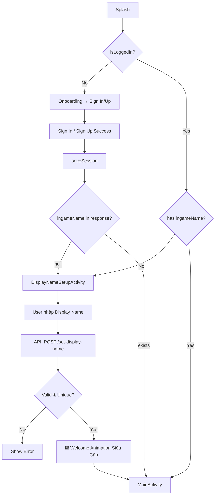

# Thêm Trường `ingameName` (Display Name) + Màn Hình Setup + Edit Profile

## Mô tả
Thêm trường **`ingameName`** — Tên hiển thị trong game cho User. Flow mới:
1. User đăng ký/đăng nhập bình thường (KHÔNG sửa Sign Up/Sign In)
2. Sau khi vào app, nếu chưa có `ingameName` → **Redirect sang màn hình Setup Display Name**
3. User nhập tên (mặc định = username), validate + check unique
4. Nếu OK → **Hiệu ứng chào mừng siêu cấp wow** → Vào game
5. Profile mới có thêm phần **Edit Info**: Username (sửa), Email (chỉ xem), Display Name (sửa), Avatar (sửa)

| Trường | Mục đích | Quy tắc |
|--------|----------|---------|
| `username` | Đăng nhập | A-Z, 0-9, `_`, 3-20 ký tự, unique |
| `email` | Xác minh, recovery | **KHÔNG cho sửa** |
| `ingameName` | **Tên hiển thị trong game** | Unicode tự do, khoảng trắng OK, 2-16 chars, unique |

---

## Anti-Cheat: "Galactic Name Shield" 🛡️

| # | Rule | Chi tiết |
|---|------|----------|
| 1 | **Độ dài: 2-16 ký tự** | Chống spam tên cực dài gây vỡ layout |
| 2 | **Cấm tên hệ thống** | `Admin`, `GM`, `System`, `Moderator`, `Mosco`, `[DEV]`, `[ADMIN]` (case-insensitive) |
| 3 | **Sanitize whitespace** | Trim đầu/cuối + gộp khoảng trắng liên tiếp → 1 |
| 4 | **Cấm ký tự điều khiển** | Unicode `\u0000`-`\u001F`, `\u007F` — chống invisible chars |
| 5 | **Unique constraint** | UNIQUE trong DB — chống 2 người cùng tên gây lừa đảo |
| 6 | **Server-side validate** | KHÔNG tin Client — Server LUÔN validate lại (Server Truth) |

---

## Proposed Changes

### 🖥️ Server — Spring Boot

---

#### [MODIFY] [User.java](file:///d:/MEox/UITer/DOAN/Mosco_Megre/Mosco/server/src/main/java/com/vn/jet/mosco/spinserver/model/User.java)
- Thêm field `ingameName` (VARCHAR, UNIQUE, **nullable** — cho phép NULL khi mới đăng ký)
- Thêm getter/setter

#### [MODIFY] [UserRepository.java](file:///d:/MEox/UITer/DOAN/Mosco_Megre/Mosco/server/src/main/java/com/vn/jet/mosco/spinserver/repository/UserRepository.java)
- Thêm `boolean existsByIngameName(String ingameName)` — check trùng tên

#### [MODIFY] [AuthResponse.java](file:///d:/MEox/UITer/DOAN/Mosco_Megre/Mosco/server/src/main/java/com/vn/jet/mosco/spinserver/dto/AuthResponse.java) (Server DTO)
- Thêm `ingameName` vào `UserData` inner class → Client biết user đã setup hay chưa

#### [MODIFY] [UserController.java](file:///d:/MEox/UITer/DOAN/Mosco_Megre/Mosco/server/src/main/java/com/vn/jet/mosco/spinserver/controller/UserController.java)
- **Thêm endpoint `POST /api/user/set-display-name`**: Nhận `{ "ingameName": "..." }`, validate theo Galactic Name Shield, lưu DB
- **Thêm endpoint `PUT /api/user/update-profile`**: Cho sửa `username` + `ingameName` (email locked). Validate cả 2 field.

#### [NEW] [DisplayNameRequest.java](file:///d:/MEox/UITer/DOAN/Mosco_Megre/Mosco/server/src/main/java/com/vn/jet/mosco/spinserver/dto/DisplayNameRequest.java)
- DTO cho endpoint set display name: `{ "ingameName": "..." }`

#### [NEW] [UpdateProfileRequest.java](file:///d:/MEox/UITer/DOAN/Mosco_Megre/Mosco/server/src/main/java/com/vn/jet/mosco/spinserver/dto/UpdateProfileRequest.java)
- DTO cho endpoint update profile: `{ "username": "...", "ingameName": "..." }`

---

### 📱 Client — Android

---

#### [MODIFY] [AuthResponse.java](file:///d:/MEox/UITer/DOAN/Mosco_Megre/Mosco/client/app/src/main/java/com/vn/jet/mosco/model/AuthResponse.java) (Client Model)
- Thêm `ingameName` vào `UserData` để nhận từ server

#### [MODIFY] [SessionManager.java](file:///d:/MEox/UITer/DOAN/Mosco_Megre/Mosco/client/app/src/main/java/com/vn/jet/mosco/utils/SessionManager.java)
- Thêm `KEY_INGAME_NAME`, `getIngameName()`, `setIngameName()`, lưu trong `saveSession()`

#### [MODIFY] [GameApiService.java](file:///d:/MEox/UITer/DOAN/Mosco_Megre/Mosco/client/app/src/main/java/com/vn/jet/mosco/network/GameApiService.java)
- Thêm endpoint: `POST /api/user/set-display-name` → `Call<ApiResponse<User>>`
- Thêm endpoint: `PUT /api/user/update-profile` → `Call<ApiResponse<User>>`

#### [NEW] [DisplayNameSetupActivity.java](file:///d:/MEox/UITer/DOAN/Mosco_Megre/Mosco/client/app/src/main/java/com/vn/jet/mosco/DisplayNameSetupActivity.java)
**Đây là highlight chính!**
- Layout: Fullscreen Galactic theme (nền vũ trụ parallax, glass card)
- Input field pre-filled với `username` từ Session
- Nút "ENTER THE GALAXY" (bg_btn_rainbow)
- Validate client-side: 2-16 chars, not empty
- Gọi API `POST /api/user/set-display-name`
- **Nếu thành công → HIỆU ỨNG CHÀO MỪNG SIÊU CẤP:**
  - Lottie confetti/particle explosion toàn màn hình
  - Text "Welcome, [ingameName]!" với hiệu ứng typewriter + glow
  - Shake/scale animation cho tên
  - Auto-navigate vào `MainActivity` sau 3 giây

#### [NEW] [activity_display_name_setup.xml](file:///d:/MEox/UITer/DOAN/Mosco_Megre/Mosco/client/app/src/main/res/layout/activity_display_name_setup.xml)
- Galactic background (parallax)
- Title: "CHOOSE YOUR NAME" (Poppins Bold, 28sp)
- Subtitle: "This is how other players will know you" (Poppins, 14sp, 0.7 alpha)
- Glass card container:
  - TextInputLayout + TextInputEditText (`edt_display_name`)
  - Character counter (X/16)
- Rainbow button "ENTER THE GALAXY"
- Loading ProgressBar

#### [MODIFY] [AndroidManifest.xml](file:///d:/MEox/UITer/DOAN/Mosco_Megre/Mosco/client/app/src/main/AndroidManifest.xml)
- Đăng ký `DisplayNameSetupActivity`

#### [MODIFY] [SplashActivity.java](file:///d:/MEox/UITer/DOAN/Mosco_Megre/Mosco/client/app/src/main/java/com/vn/jet/mosco/SplashActivity.java) (line 257)
- Check tại điểm navigation: `isLoggedIn && ingameName == null` → **go to DisplayNameSetupActivity** thay vì MainActivity

#### [MODIFY] [SignInActivity.java](file:///d:/MEox/UITer/DOAN/Mosco_Megre/Mosco/client/app/src/main/java/com/vn/jet/mosco/SignInActivity.java) (line 147-162)
- Sau `saveSession()`: check `ingameName` null → go to `DisplayNameSetupActivity`

#### [MODIFY] [SignUpActivity.java](file:///d:/MEox/UITer/DOAN/Mosco_Megre/Mosco/client/app/src/main/java/com/vn/jet/mosco/SignUpActivity.java) (line 173-190)
- Sau `saveSession()`: check `ingameName` null → go to `DisplayNameSetupActivity`

#### [MODIFY] [HomeFragment.java](file:///d:/MEox/UITer/DOAN/Mosco_Megre/Mosco/client/app/src/main/java/com/vn/jet/mosco/fragment/HomeFragment.java) (line 880)
- Đổi `sessionManager.getUsername()` → `sessionManager.getIngameName()` — hiển thị Display Name trên Dashboard

#### [MODIFY] [ProfileFragment.java](file:///d:/MEox/UITer/DOAN/Mosco_Megre/Mosco/client/app/src/main/java/com/vn/jet/mosco/fragment/ProfileFragment.java)
- Hiển thị `ingameName` thay vì `username`
- **Thêm nút "EDIT PROFILE"** → mở `dialog_edit_profile.xml`
  - Username: editable (TextInputEditText)
  - Email: read-only (disabled, alpha 0.5)
  - Display Name: editable (TextInputEditText)
  - Avatar: Tap ảnh → mở picker (flow hiện tại)
  - Nút "Save" → gọi API `PUT /api/user/update-profile`

#### [NEW] [dialog_edit_profile.xml](file:///d:/MEox/UITer/DOAN/Mosco_Megre/Mosco/client/app/src/main/res/layout/dialog_edit_profile.xml)
- Card style tương tự `dialog_spin_confirm.xml` (bg `#1A1C29`, rounded 16dp)
- Title: "Edit Profile" (Poppins Bold 18sp)
- 3 fields: Username, Email (disabled), Display Name
- 2 buttons: Cancel (ghost) + Save (rainbow/purple)

#### [MODIFY] [strings.xml](file:///d:/MEox/UITer/DOAN/Mosco_Megre/Mosco/client/app/src/main/res/values/strings.xml)
- `setup_title` = "CHOOSE YOUR NAME"
- `setup_subtitle` = "This is how other players will know you"
- `setup_btn_enter` = "ENTER THE GALAXY"
- `setup_welcome` = "Welcome, %s!"
- `prompt_display_name` = "Display Name"
- `error_display_name_length` = "Display name must be 2-16 characters"
- `error_display_name_reserved` = "This name is not allowed"
- `error_display_name_taken` = "This name is already taken"
- `profile_btn_edit` = "EDIT PROFILE"
- `profile_edit_title` = "Edit Profile"
- `profile_save` = "Save"

---

## Execution Flow Summary

---

## Tổng Kết Files

| Loại | Server | Client | Tổng |
|------|--------|--------|------|
| **Modify** | 4 | 9 | 13 |
| **New** | 2 | 3 | 5 |
| **Total** | **6** | **12** | **18** |

---

## Verification Plan

### Automated Tests
- Server: `mvn clean compile` — không lỗi compile
- Client: `gradlew assembleDebug` — không lỗi build

### Manual Verification
1. **User mới** → Đăng ký → Redirect sang Display Name Setup → Nhập tên → Welcome effect → Vào game
2. **User cũ chưa có tên** → Login → Redirect sang Setup → Nhập tên → Vào game
3. **User cũ đã có tên** → Login → Thẳng vào game (skip setup)
4. **Validation**: Tên < 2, > 16, tên reserved, trùng → Server reject
5. **Profile**: Sửa username OK, sửa display name OK, email read-only
6. **Home Dashboard**: Hiển thị `ingameName` thay vì `username`
